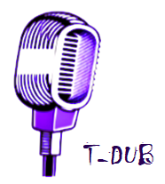
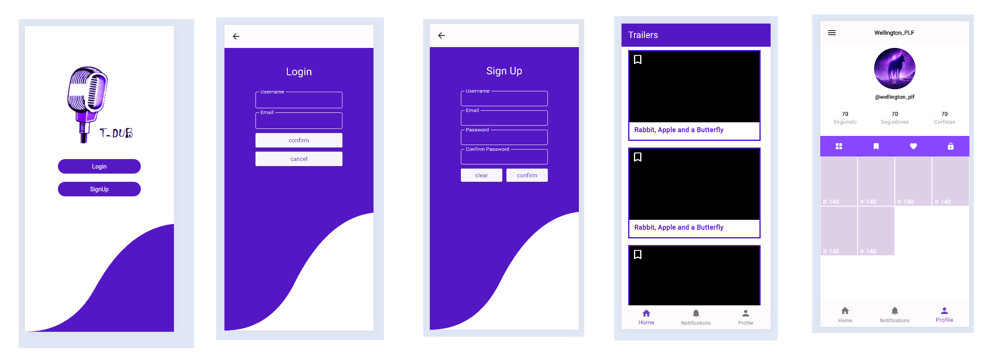

<h1 align="center">
  
</h1>

  <a href="#-tecnologias">Tecnologias</a>&nbsp;&nbsp;&nbsp;|&nbsp;&nbsp;&nbsp;
  <a href="#-projeto">Projeto</a>&nbsp;&nbsp;&nbsp;|&nbsp;&nbsp;&nbsp;
  <a href="#-layout">Layout</a>&nbsp;&nbsp;&nbsp;|&nbsp;&nbsp;&nbsp;
  <a href="#-como-executar">Como executar</a>&nbsp;&nbsp;&nbsp;|&nbsp;&nbsp;&nbsp;
  <a href="#-licença">Licença</a>

  

 

 

  

## ✨ Tecnologias

Esse projeto foi desenvolvido com as seguintes tecnologias:

- [Flutter](https://www.flutter.dev)
- [Dart](https://dart.dev)

## 💻 Projeto

O T-Dub é um app que tem como proposta permitir ao usuário uma maneira simples de criar seus próprios clipes focados em dublagem.

## 🔖 Layout

Você pode visualizar o layout do projeto através da imagem apresentada logo acima.

## 🚀 Como executar

- Clone o repositório
- Instale as dependências com `flutter pub get`
- Inicie a aplicação no vscode atraves do simulador `Pixel 3 API 35`
ao entrar no arquivo main.dart e selecionar `Run`

Agora você pode visualizar e utilizar a aplicação.

## 📄 Licença

Esse projeto está sob a licença MIT. Veja o arquivo [LICENSE](LICENSE.md) para mais detalhes.

---

Feito com ♥ by WellingtonPLF 👋🏻 [Contact Me 😊](https://mail.google.com/mail/?view=cm&fs=1&to=wellplf@gmail.com)